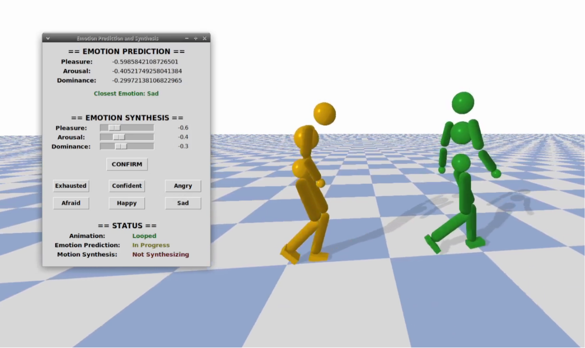

# Emotional Identification and Tweaking of Kinematic and Policy-Controlled Physics Enabled Virtual Characters

## Introduction
This repository contains the full code basis for the Master Thesis Project "*Emotional Identification and Tweaking of Kinematic and Policy-Controlled Physics Enabled Virtual Characters*"

[

This project consists in a system capable of visualizing Motion Capture data, automatically analyze the character's motion to predict which emotion its trying to express using Pleasure, Arousal and Dominance coordinates and allow for the editing and tweaking of the desired expressed emotion by users, with motion changes being synthesized and applied to the character in real time.  The system was trained and designed with a focus on Locomotion animations such as Walking, Running and Dashing but it can still be applied to other types of animations although results may vary.

Using a codebasis from [Learning and Exploring Motor Skills with Spacetime Bounds](http://https://github.com/milkpku/spacetimeBounds "Learning and Exploring Motor Skills with Spacetime Bounds") our system can also learn to mimic motions using physics-enabled virtual characters. The aforementioned emotional identification and tweaking operations can be applied to either Kinematic or Policy Controlled Physics-Enabled characters.

## Links
- [Website](http://ass "Website")
- [Paper](http://ass "Paper")
- [Thesis](http://ass "Thesis")
- [Video](http://ass "Video")
- [Results](http://ass "Results")
- [Video Clips](https://www.youtube.com/playlist?list=PLBchdrsdyMe_y7oUAzumcPc3P5ft3SMi4)

## Dataset
We used a subset of the [Bandai-Namco-Research-Motiondataset](http://https://github.com/BandaiNamcoResearchInc/Bandai-Namco-Research-Motiondataset "Bandai-Namco-Research-Motiondataset") containing only Locomotion animations - Walking, Running and Dashes.

## Dependencies
|Name   | Version  | Type |
| ------------ | ------------ | ------------ |
| CMake  | 3.11.0 (or later)  | C++ |
| Clang  |  10.0.1 (required) | C++ |
| PyBullet   |  2.89 (required)  | C++ |
| swig  |  4.0.2 (or later)  | C++ |
| Eigen   |  3.3.7 (or later)  | C++ |
| Jupyter Notebook   |  6.4.8   | Python |
| PyTorch   |  1.8.0 | Python |
|  numpy  | 1.19.1  | Python |
|  numba | 0.50.0  | Python |
| tensorboardX  |  2.2  | Python |
| xgboost  | 1.5.2   | Python |
| tk  | 0.1.0    | Python |
| tensorflow  |  2.8.0   | Python |
| Keras  | 2.8.0  | Python |
| scipy  |   1.4.1  | Python |
| seaborn  |   0.11.2  | Python |
| scikit-learn   |  1.0.2 | Python |
| pandas   |   1.4.0   | Python |
| matplotlib  |  3.5.1 | Python |
| joblib  |  1.1.0   | Python |
|bvhtodeepmimic |  0.0.5   | Python

### C++
`sudo apt install libgl1-mesa-dev libx11-dev libxrandr-dev libxi-dev`

`sudo apt install mesa-utils`

`sudo apt install clang`

`sudo apt install cmake`

- **Bullet**
	 Download Version 2.89 from https://github.com/bulletphysics/bullet3/releases
	 `./build_cmake_pybullet_double.sh`
	 `cd build_cmake`
	 `sudo make install`

- **Eigen**
	 Download Version 3.37 from http://www.eigen.tuxfamily.org/index.php?title=Main_Page
	 Extract the downloaded package somewhere and navigate into the folder
	 `mkdir build && cd build`
	 `cmake ..`
	 `sudo make install`

- **swig**
	 Download the latest version from http://www.swig.org/
	 Extract the downloaded package somewhere and navigate into the folder
	 `./configure --without-pcre`
	 `make`
	 `sudo make install`

### Python
Install **Python3.8 **or Python3.7
Install all other Python Dependencies using Pip

### OS
This work was developed on xUbuntu. It should still be able to run on other Operating Systems, as long as the dependencies are properly installed.

## Installation
Before usage the Kinematic folder located within the Motion Learning directory must be compiled

`cd motion_learning/Kinematic && mkdir build && cd build`

`cmake .. -DEIGEN_INCLUDE_PATH=<path_to_eigen_src_dir> -DPYTHON_INCLUDE_PATH=<path_to_python_include_dir>`

`make -j8`

You also have to manually add the trained machine learning models as these were too large to be included within the repository:
- **Emotion Classifier Models**
	1. Download the *emotion_classifier_models.tar.gz* file from [https://www.dropbox.com/sh/2zc2tn0zwwjydvs/AABAJUMMXmk8ruee5OPspOWUa?dl=0](http://https://www.dropbox.com/sh/2zc2tn0zwwjydvs/AABAJUMMXmk8ruee5OPspOWUa?dl=0 "https://www.dropbox.com/sh/2zc2tn0zwwjydvs/AABAJUMMXmk8ruee5OPspOWUa?dl=0")
	2. **Extract on the emotion_classifier/models/ folder**
	All files ending in .json should be placed in the emotion_classifier/models/
	All files ending in .pkl should be placed in the emotion_classifier/models/scalers

- **Motion Synthesis Models**
	1. Download the *motion_synthesis_models.tar.gz* file from [https://www.dropbox.com/sh/2zc2tn0zwwjydvs/AABAJUMMXmk8ruee5OPspOWUa?dl=0](http://https://www.dropbox.com/sh/2zc2tn0zwwjydvs/AABAJUMMXmk8ruee5OPspOWUa?dl=0 "https://www.dropbox.com/sh/2zc2tn0zwwjydvs/AABAJUMMXmk8ruee5OPspOWUa?dl=0")
	2. **Extract on the motion_synthesizer/models/ folder**

## Usage
### Visualization, Emotion Identification and Tweaking - Kinematic Character
1. Navigate to the Motion Learning folder - `cd motion_learning`
2. Run the following command:

`python3 vis_mocap_2.py --mocap=<PATH_TO_TXT_MOCAP_FILE>  --ms=<MOTION SYNTHESIS OPTION>`

You can specify the type of Motion Synthesis to be used - Direct, AutoEncoder or None - providing the `--ms` argument with the values` 'direct'`, `'ae'` or `''`

**Arguments**:
- *--mocap* - Obligatory - Specifies the path to the MoCap file that will be displayed
- *--ms* - Optional (Default - '') - Specifies the type of Motion Synthesis methoodlogy to be used - *ae*, *xgb*, *direct*, *''*
- *--record_lma* - Optional (Default - False) - Specify a file name if you want to store the recorded LMA Features on a file
- *--record_mocap* - Optional (Default - False) - Specify a file name if you want to store the recorded Mocap on a file

**Example:**  `python3 vis_mocap_2.py --mocap="mocap/bandai_neutral.txt" --ms=ae`

> Note: Alternatively, you can use **vis_mocap.py** instead. All this changes is that motion synthesis is computed as a batch rather than on a per-frame basis

------------

### Visualization, Emotion Identification and Tweaking - Policy-Controlled Character
1. Navigate to the Motion Learning folder - `cd motion_learning`
2. Run the following command:

`python3 run_model.py <PATH_TO_ARGS_FILE>  --ms=<MOTION SYNTHESIS OPTION>`

You can specify the type of Motion Synthesis to be used - Direct, AutoEncoder or None - providing the `--ms` argument with the values` 'direct'`, `'ae'` or `''`

**Arguments**:
- *--mocap* - Obligatory - Specifies the path to the MoCap file that will be displayed
- *--ms* - Optional (Default - '') - Specifies the type of Motion Synthesis methoodlogy to be used - *ae*, *xgb*, *direct*, *''*
- *--record_lma* - Optional (Default - False) - Specify a file name if you want to store the recorded LMA Features on a file
- *--record_mocap* - Optional (Default - False) - Specify a file name if you want to store the recorded Mocap on a file

**Example:**  `python3 run_model.py args/demo_ablation_walk_07.json --ms=ae`

> **Note**: Alternatively, you can use **vis_mocap.py** instead. All this changes is that motion synthesis is computed as a batch rather than on a per-frame basis

> **Note**: The specified MoCap file must be written in a specific "DeepMimic-friendly" format. Check the "*Converting BVH Files to DeepMimic friendly format*" section for instructions on how to generate these files.

------------

### Train Policy Character Controller
1. Navigate to the Motion Learning folder - `cd motion_learning`
2. Run the following command:
`python3 train.py <PATH_TO_ARGS_FILE>  -id <TRAINING_NAME>`

You can specify several training parameters such as number of iterations, type of environment amongst others within the specified *args* file. Check the *args* folder for examples.

**Example:**  `python3 train.py train_bandai_walk.json -id "bandai_walk_train"`

------------

### Visualization, Emotion Identification and Tweaking - Policy-Controlled Character
1. Navigate to the Motion Learning folder - `cd motion_learning`
2. Run the following command:

`python3 run_model.py <PATH_TO_ARGS_FILE>  --ms=<MOTION SYNTHESIS OPTION>`

You can specify the type of Motion Synthesis to be used - Direct, AutoEncoder or None - providing the `--ms` argument with the values` 'direct'`, `'ae'` or `''`

**Example:**  `python3 run_model.py args/demo_ablation_walk_07.json --ms=ae`

------------

### Converting BVH files into a DeepMimic friendly format
1. Navigate to the Mocap Converter folder - `cd mocap_converter`
2. Run the following command: `python3 bvh_converter.py`
3. Specify your input BVH file (the file you want to convert), settings file (the file containing the conversion settings) and output file (name of the generated file)

For more information check out [BVHToMimic](http://https://github.com/BartMoyaers/BvhToDeepMimic "BVHToMimic").

------------

### Mass Extracting LMA Features
You can extract the Laban Movement Analysis Features from all Deepmimic-friendly MoCap files within a directory.
1. Navigate to the LMA Extractor folder - `cd lma_extractor`
2. Open the file `mass_kin_lma_extractor.py` with a text editor
3. Alter the variables:
	*input_directory* - The path to the directory containing your MoCap files
	*output_directory* - The path to the directory where your files with the LMA Features will be stored
	*e_meta_file_path* - The path to the generated Meta File containing the emotions of all files
	*f_meta_file_path* - The path to the generated Meta File contianing the names of all generated files

> **Note**: For this to work, its important that your MoCap files follow the naming scheme *emotion_filename*

## Author
This work was created for the acquisition of a Masters in Computer Science and Engineering at Instituto Superior Técnico (2022) by **Diogo Silva**

